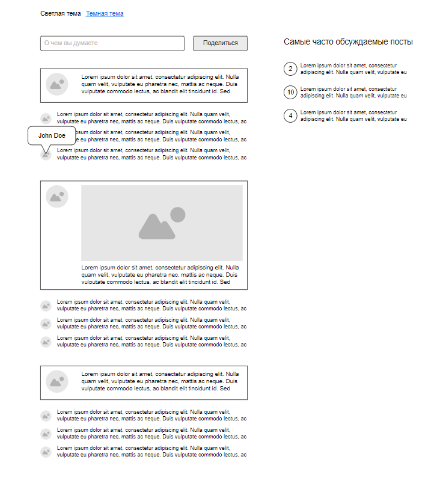

# gp-tweets

## Project setup
```
npm install
```

### Compiles and hot-reloads for development
```
npm run serve
```

### Compiles and minifies for production
```
npm run build
```

### Lints and fixes files
```
npm run lint
```


Ссылка на [Техническое задание](task-description.txt).

### Пример макета:
[](task-mockup.png)
